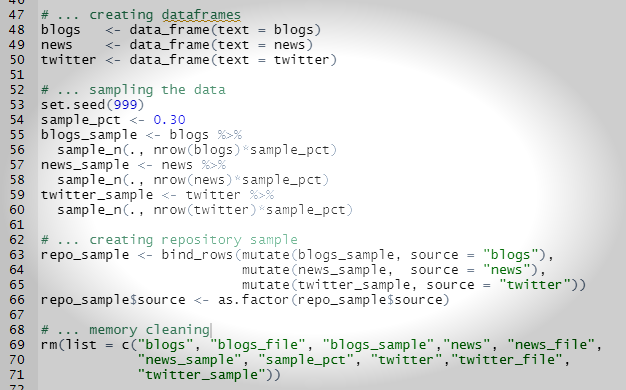
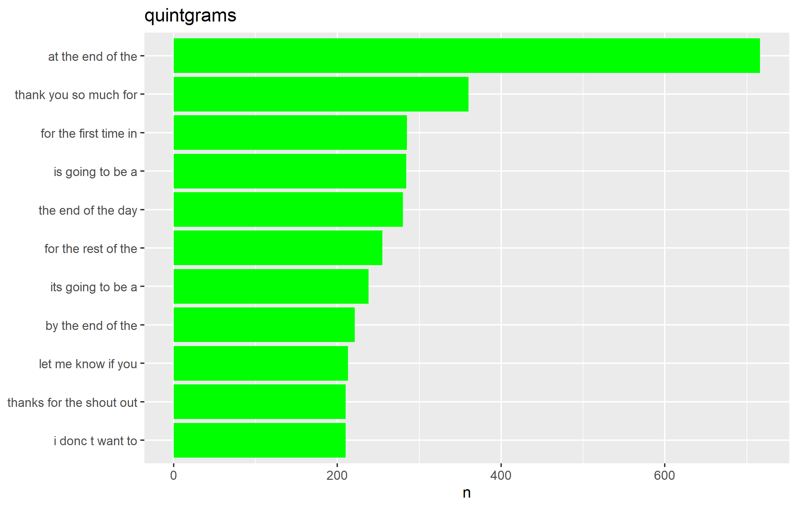
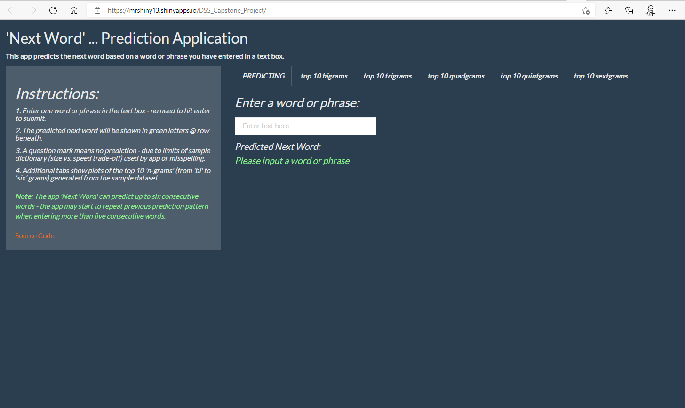
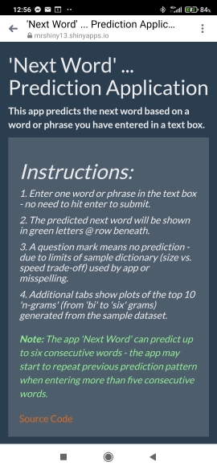
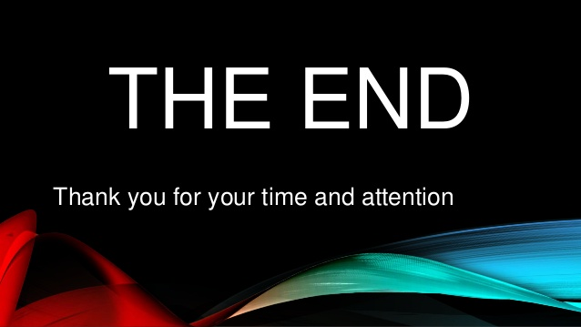

**The Project**
========================================================

The project involves Natural Language Processing (NLP) and critical task is to 
predict next word based on a user's input, a word or phrase.  

**Project deliverables:**  

- **Prediction Model**, R based algorithm for 'Next Word' app, hosted @ GitHub.com
- **'Next Word' Prediction App** hosted @ shinyapps.io
- **Presentation** hosted at RPubs.com

Prediction Model for the 'Next Word' App 
========================================================
[source code repository on Github](https://github.com/MRHub13/DSS-Capstone-Project)

The next word prediction model uses the principles of "tidying data" applied to text mining in R. 
Key model steps include: 

1. input raw text files for model training & trimming
2. cleaning training data - separating into 2, 3, 4, 5 & 6 word 'n-grams' & saving as tables
3. sorting 'n-grams' tables by frequency & saving as repos
4. 'n-grams' function: uses a "back-off" type prediction model
   - user enters a word or phrase
   - model uses last up to 5 words (min. 1) to predict the best match in the repos
5. Output is 'Next Word' prediction

Benefits: code - easy to read & to use; uses "pipes" & "cascades"; fast processing of training data; able to sample more than 20% of original corpus; comparably small output repos

**Prediction Model Code Sequence:**
```{r echo=FALSE, fig.cap="", out.width = '80%'}

```

**Example of 10 most frequent quintgrams:**
```{r echo=FALSE, fig.cap="", out.width = '80%'}

```

'Next Word' Prediction App
========================================================
[link to 'Next Word' prediction app](https://mrshiny13.shinyapps.io/DSS_Capstone_Project/)

The next word prediction app provides a simple user interface to the 'Next Word' prediction model.  

**Key Features:**  

1. 'Text Box' for user input  
2. output (next word) is predicted simultaneously by user input  
3. tabs showing plots of most frequent 'n-grams' in the data set
4. user instructions on side panel   

**Key Benefits:**  

1. *Easy to use* on different platforms & screens - size responsive web app   
2. *Fast response*
2. 'NextWord' prediction model (method) *is suitable for large training datasets* which makes possible further better next word predictions

[Shiny App Link](https://mrshiny13.shinyapps.io/DSS_Capstone_Project/)


**Screenshot of ‘Next Word’ Desktop App**

```{r echo=FALSE, fig.cap="", out.width = '80%'}

```

... & 

**Screenshot of ‘Next Word’ Mobile App**

```{r echo=FALSE, fig.cap="", out.width = '20%'}

```

Documentation and Source Code
========================================================

Tidy Data  
"http://vita.had.co.nz/papers/tidy-data.html"

Text Mining with R: A Tidy Approach  
"http://tidytextmining.com/index.html"

Data Science Specialization - Courses 
"https://github.com/DataScienceSpecialization/courses"

Shiny App    
"https://mrshiny13.shinyapps.io/DSS_Capstone_Project/"

Source Code Repository on Github - Algorithms for Prediction Model & Shiny App     
"https://github.com/MRHub13/DSS-Capstone-Project"

Project Presentation
"https://rpubs.com/MRPub13/776824"

```{r echo=FALSE, fig.cap="", out.width = '70%'}

``` 

Maroje Raguž
```{r echo=FALSE}
``` 
maroje@raguz.us

